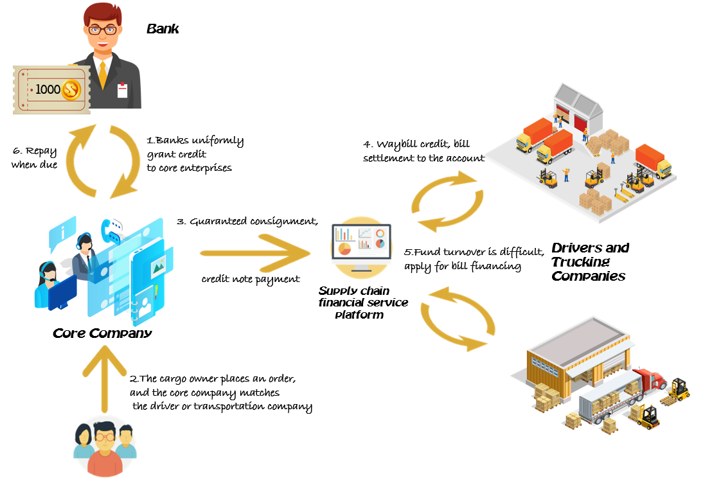
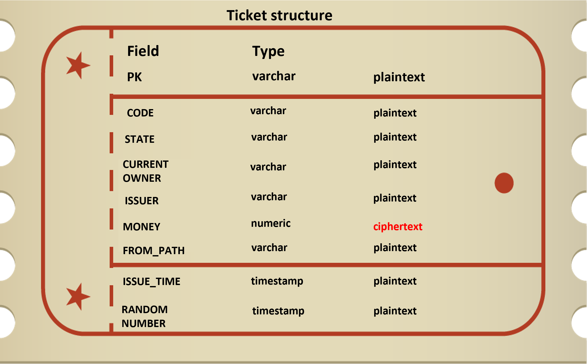
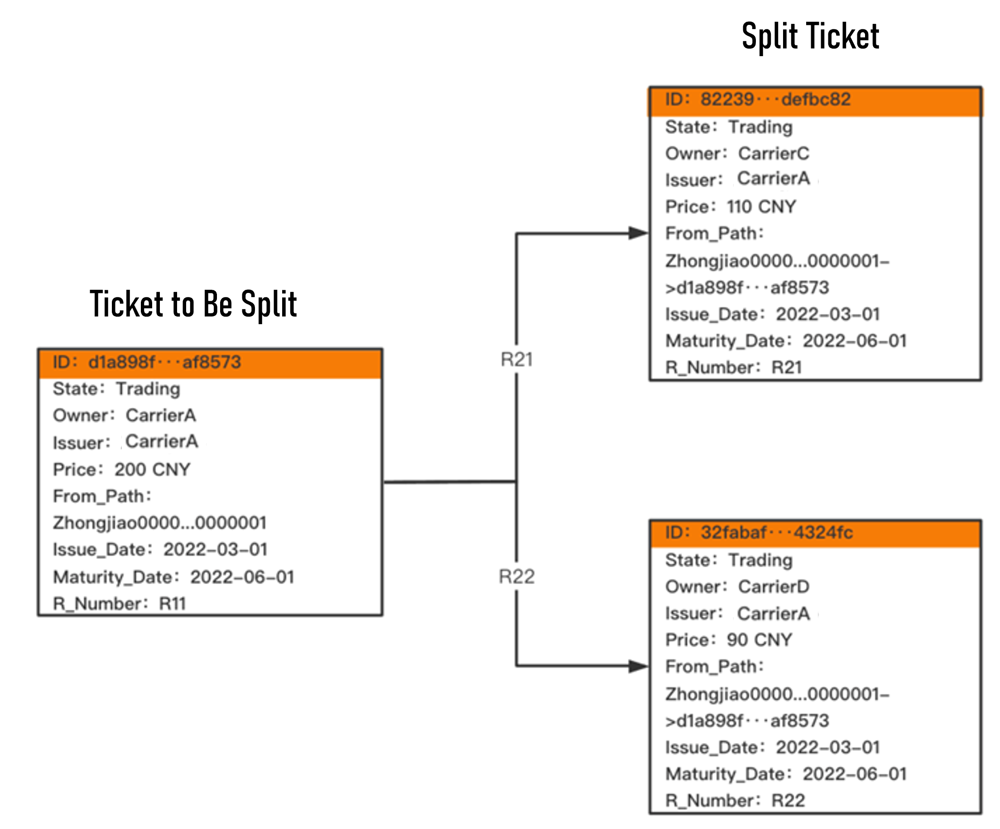
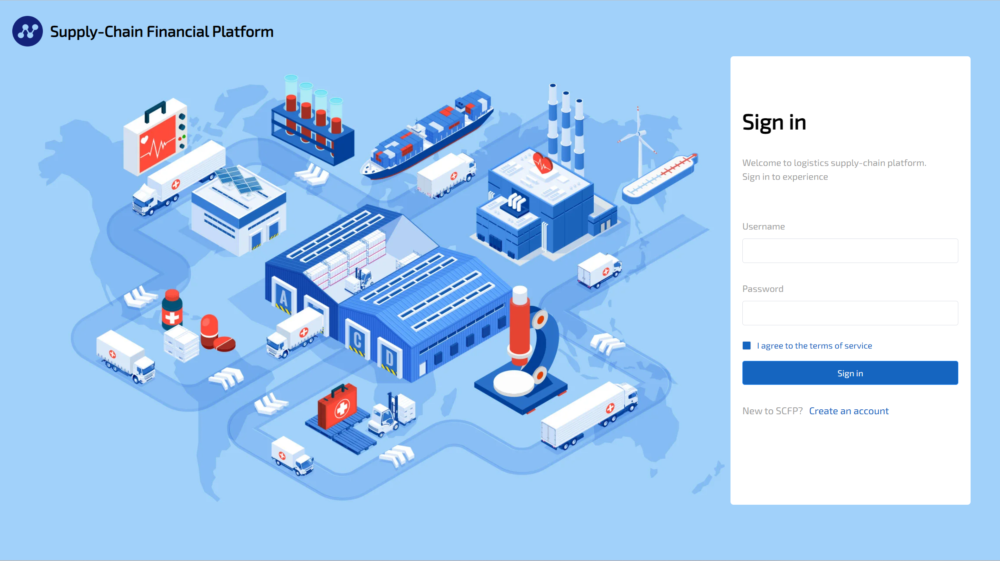
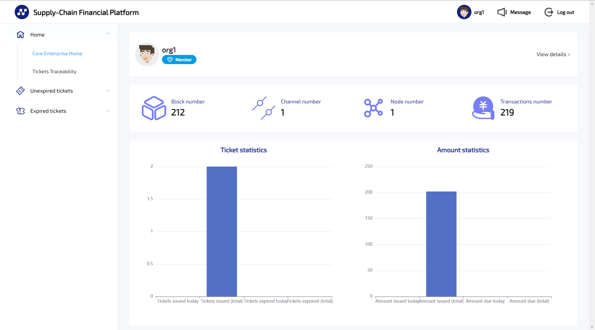
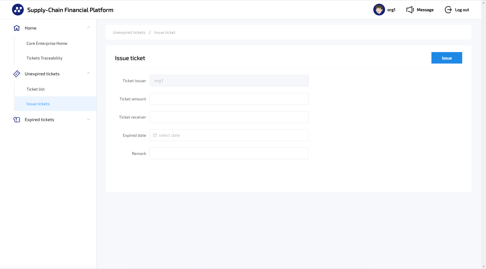
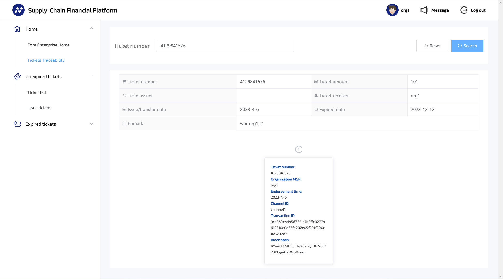

# Financial Platform for Supply Chain

#### Our program committed to apply blockchain technology to ensure that the information on the chain, such as transportation, orders, transactions, and enterprises, is authentic and effective, and will not be tampered with. Through our supply chain financial platform, we aim to:
- Make corporate users and financial institutions accurately connected to achieve fast corporate users and financial institutions to achieve fast certificate cashing
- Reduce financial pressure on corporate users
- Help financial institutions, platforms, and users achieve a win-win situation.
  
<div align="center">
   
</div>


## Project structure
### Front-End
#### Our front-end development based on the commonly used Vue framework to provide users with an interactive interface.
### Back-end
#### The back-end management system is developed based on the SpringBoot framework. It is used to receive requests from users from the front end, interact with the blockchain system, and display data returned from the blockchain on the front end.
### Blockchain interaction Module
#### The interaction between the system and the blockchain relies on the interfaces and methods provided by Hyperledger Fabric.We implement our network through Fabric deployment and realize the function of electronic bills. Through the link between the back-end and the Fabric interface, we transfer data from the chain to the back-end module.
-------

## Local deployment and quick start
### Development Environment
* **JDK 1.8 +**
* **go 1.15**
* **Maven 3.5+**
* **lombok**
* **Docker Version: 23.0.1**
* **Hyperledger Fabric v2.4**
* **Mysql 5.7+**
* **Node V19.X**
* **npm 5.7.X**
* IntelliJ IDEA 2018.2+
### Quick Start
#### Front-end service start（_In the directory: ./Front-End_）
* Install dependencies  
  ```npm install```
* Start local server  
  ```npm run serve```
#### Blockchain interaction module configuration
* Docker configuration
  * Install dependencies  
    ```sudo yum install -y yum-utils device-mapper-persistent-data lvm2```
  * Install dockerCE  
    ```sudo yum install -y docker-ce```
  * Add the current user to the docker user group
    ```
    sudo groupadd docker
    sudo gpasswd -a $USER docker
    newgrp docker #refresh docker group
    ```
  * Docker serve start  
    ```sudo systemctl start docker.service```
  * Install docker-compose  
    ```sudo yum install -y docker-compose```
* Fabric configuration
  * Install fabric image  
    ```
    git clone https://github.com/hyperledger/fabric.git
    git checkout -b release-2.4 remotes/origin/release-2.4
    cd $GOPATH/src/github.com/hyperledger/fabric/scripts/bootstrap.sh
    ```
  * Network config  
    ```
    sudo vi /etc/hosts
    192.168.137.132 orderer1.example.com
    192.168.137.133 orderer2.example.com
    192.168.137.134 orderer3.example.com
    192.168.137.132 peer0.org1.example.com
    192.168.137.133 peer0.org2.example.com
    192.168.137.134 peer0.org3.example.com

    sudo /etc/init.d/network restart #Restart network
    sudo sysctl -w net.ipv4.ip_forward=1
    ```
  * Install go
    ```
    sudo yum install -y epel-release
    sudo yum install -y golang
    ```
  * Docker service start
    * docker-compose-orderer.yaml
      ```
      docker-compose -f ./docker-compose-orderer62.yaml up -d
      docker-compose -f ./docker-compose-orderer62.yaml down -v
      ```
    * docker-compose-cli.yaml
      ```
      docker-compose -f ./docker-compose-cli62.yaml up -d
      docker-compose -f ./docker-compose-cli62.yaml down -v
      ```


  * Fabric service start（_In the directory: ./fabric-samples_）
    *  Run fabric service  
       ```
       ./network.sh up createChannel -s couchdb
       ```
    *  Add node org3  
       ```
       cd addOrg3

       ./addOrg3.sh up -c mychannel
       ```
    * Deploy chaincode  
      ```
      cd ..

      ./network.sh deployCC -ccn private -ccp ../chaincode/scf_chaincode/ -ccl go -ccep "OR('Org1MSP.peer','Org2MSP.peer','Org3MSP.peer')" -cccg ../chaincode/scf_chaincode/api/collections_config.json
      ```
    * Call the deployed chaincode (_Select one of the following environments and execute it in the ./test-network directory_)
      ```
      export PATH=${PWD}/../bin:$PATH
      export FABRIC_CFG_PATH=$PWD/../config/
      export CORE_PEER_TLS_ENABLED=true
      export CORE_PEER_LOCALMSPID="Org1MSP"
      export CORE_PEER_TLS_ROOTCERT_FILE=${PWD}/organizations/peerOrganizations/org1.example.com/peers/peer0.org1.example.com/tls/ca.crt
      export CORE_PEER_MSPCONFIGPATH=${PWD}/organizations/  peerOrganizations/org1.example.com/users/Admin@org1.example.com/msp
      export CORE_PEER_ADDRESS=localhost:7051

      export PATH=${PWD}/../bin:$PATH
      export FABRIC_CFG_PATH=$PWD/../config/
      export CORE_PEER_TLS_ENABLED=true
      export CORE_PEER_LOCALMSPID="Org2MSP"
      export CORE_PEER_TLS_ROOTCERT_FILE=${PWD}/organizations/peerOrganizations/org2.example.com/  peers/peer0.org2.example.com/tls/ca.crt
      export CORE_PEER_MSPCONFIGPATH=${PWD}/organizations/peerOrganizations/org2.example.com/  users/Admin@org2.example.com/msp
      export CORE_PEER_ADDRESS=localhost:9051


      export PATH=${PWD}/../bin:$PATH
      export FABRIC_CFG_PATH=$PWD/../config/
      export CORE_PEER_TLS_ENABLED=true
      export CORE_PEER_LOCALMSPID="Org3MSP"
      export CORE_PEER_TLS_ROOTCERT_FILE=${PWD}/organizations/peerOrganizations/org3.example.com/  peers/peer0.org3.example.com/tls/ca.crt
      export CORE_PEER_MSPCONFIGPATH=${PWD}/organizations/peerOrganizations/org3.example.com/  users/Admin@org3.example.com/msp
      export CORE_PEER_ADDRESS=localhost:11051
      ```
    * Initialize the chaincode
      ```
      peer chaincode invoke -o localhost:7050 --ordererTLSHostnameOverride orderer.example.com --tls --cafile "${PWD}/organizations/ordererOrganizations/example.com/orderers/orderer.example.com/msp/tlscacerts/tlsca.example.com-cert.pem" -C mychannel -n private -c '{"function":"Init","Args":[]}'
      ```
    * Create new ticket
      ```
      export Ticket_PROPERTIES=$(echo -n "{\"price\":\"101\",\"fromOrder\":\"ccccit\"}" | base64 | tr -d \\n)

      peer chaincode invoke -o localhost:7050 --ordererTLSHostnameOverride orderer.example.com   --tls --cafile "${PWD}/organizations/ordererOrganizations/example.com/orderers/orderer.  example.com/msp/tlscacerts/tlsca.example.com-cert.pem" -C mychannel -n private -c '  {"function":"CreateTicket","Args":["yanghao001"]}' --transient "  {\"ticket_properties\":\"$Ticket_PROPERTIES\"}"
      ```
    * Inquiry ticket
      ```
      peer chaincode query  -o localhost:7050 --ordererTLSHostnameOverride orderer.example.com --tls --cafile "${PWD}/organizations/ordererOrganizations/example.com/orderers/orderer.example.com/msp/tlscacerts/tlsca.example.com-cert.pem" -C mychannel -n private -c '{"function":"ReadTicketPrivateProperties","Args":["1779185060"]}'
      ```
    * Transfer ticket
      ```
      peer chaincode invoke -o localhost:7050 --ordererTLSHostnameOverride orderer.example.com --tls --cafile "${PWD}/organizations/ordererOrganizations/example.com/orderers/orderer.example.com/msp/tlscacerts/tlsca.example.com-cert.pem" -C mychannel -n private -c '{"function":"TransferTicket","Args":["1779185060","Org2MSP"]}'  --transient "{\"ticket_properties\":\"$Ticket_PROPERTIES\"}"
      ```
* Run back-end service(_In the directory: ./Java_)  
  ``` mvn spring-boot:run ```
-------
## Project Component And Method Description
### Fabric commend
Commend | Description
----|----
peer | The main node module is responsible for storing blockchain data, running and maintaining chain code
orderer | Responsible for sorting transactions and packaging the sorted transactions into blocks
cryptogen | Organization and Certificate Generation Module
configtxgen | Block and Transaction Generation Module
configtxlator | Block and transaction parsing module
----

### Description of some backend components
Name | Description
---- | ----
TicketsInfo | Define the information of tickets, including issued amount, number of due tickets, the total number of issued tickets, etc.
ChaincodeCaller | Call the services provided by the blockchain through ChaincodeConnection
ChaincodeConnection | Load the local configuration and connect to the blockchain network
TicketController | Process the request from the front-end and call the blockchain function through the established network connection.And return the information from the chain to the front-end.
ChaincodeService | Obtain block information from the blockchain and perform operations on the block.
FabricApplication | The main function of the back-end module  used to start the entire back-end service.
----

### Ticket content and structure
* Ticket content
<div align="center">
   
</div>

* Ticket structure (_Instance of splitting in two_)
<div align="center">
   
</div>


## Platform display  


<div align="center">
   
</div>
<div align="center">
   
</div>
<div align="center">
   
</div>
<div align="center">
   
</div>

## Reference documents
* [Fabric's documentation](https://docs.fabfile.org/en/stable/index.html)
* [Docker docs](https://docs.docker.com/)
